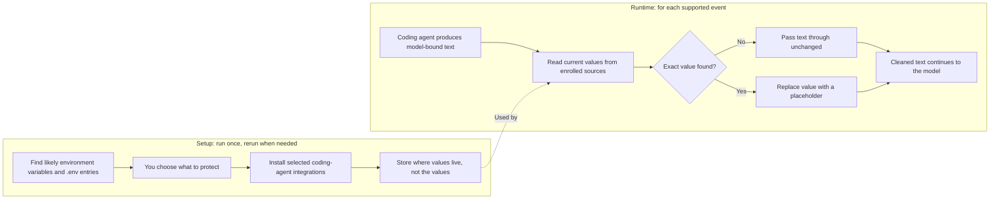

# SecretSieve

**A small, local safety net for secrets used around coding agents.**

SecretSieve replaces secret values you choose before supported coding-agent text
reaches the model:

```text
GITHUB_TOKEN=ghp_example  ->  GITHUB_TOKEN=<SECRET:GITHUB_TOKEN>
```

> **Choose what counts as secret. Replace exact matches. Keep working.**

It only replaces exact values from sources you choose, and only in supported
parts of a coding agent. It is an extra safety net, not a promise to cover every
way a secret can be exposed or used.

> **Status:** Pre-release. `v1.0.0-alpha.1` is available, but stable V1 has not
> been published yet. See [Quick Start](#quick-start) for the current install
> command.

## Why Use It?

Imagine asking a coding agent to debug your app. It reads `.env` or runs a command
such as `printenv`. Most of the output is useful, but it also contains an API key.
That key may become part of the next request to the model.

SecretSieve does not block the file read or command. The local operation still
happens. On a supported integration path, SecretSieve changes the text headed to
the model and leaves the rest useful:

```text
DATABASE_URL=postgres://localhost/my_app
API_TOKEN=<SECRET:API_TOKEN>
LOG_LEVEL=debug
```

This is deliberately a small tool. It is not trying to recognize every possible
secret or control everything an agent can do.

## Guided Setup, Boring Runtime

Setup does the thoughtful part: it suggests likely environment variables and
entries in `.env` files, shows only masked previews, lets you choose what to
protect, and installs the coding-agent integrations you select.

Daily use is boring on purpose: SecretSieve reads the current values, performs
local exact-text replacement, and exits. There is no daemon, network request,
account, hosted service, or LLM deciding what looks secret. Clean events are
silent.



SecretSieve stores where to find each value, such as “the `API_TOKEN` environment
variable” or “the `STRIPE_KEY` entry in `.env.local`.” It does not copy the value
into its configuration. Changes to `.env` files apply on the next supported
event. Environment changes apply after you restart the coding agent.

## Quick Start

### 1. Install

While SecretSieve is in pre-release, install the published alpha explicitly:

```bash
curl -fsSL https://raw.githubusercontent.com/daniel-sc/secretsieve/main/install.sh |
  bash -s -- --version 1.0.0-alpha.1
```

After stable V1 is published, the shorter command will install the latest stable
release:

```bash
curl -fsSL https://raw.githubusercontent.com/daniel-sc/secretsieve/main/install.sh | bash
```

The binary is installed to `~/.local/bin/secretsieve` by default. Make sure that
directory is on your `PATH`.

### 2. Set Up A Project

Run this from the project where you use your coding agent:

```bash
secretsieve setup
```

Setup is interactive and safe to rerun. It walks through:

1. secrets you use across projects;
2. secrets from the current project;
3. coding-agent integrations;
4. an offline check that the selected integrations work.

Complete secret values are never displayed. Suggestions are only suggestions;
you make the final choices.

### 3. Check It

```bash
secretsieve status
```

Then work normally. SecretSieve stays quiet unless it replaces something or
finds a problem the coding agent can show.

## What It Is Good At

- **Keeping useful output.** Commands and file reads still happen. Only enrolled
  values are replaced on supported model-bound paths.
- **Being predictable.** Matching is literal, case-sensitive, and deterministic.
  There is no runtime guess about whether arbitrary text looks sensitive.
- **Handling private token formats.** A value does not need to match a known API
  key pattern. If you enroll its source, its current exact value can be matched.
- **Following rotation.** SecretSieve reads the selected environment variables
  and `.env` entries for each supported event instead of keeping copied values.
- **Staying small and local.** Runtime has no network calls, telemetry, account,
  subscription, or persistent logging.

## Supported Coding Agents

V1 supports Linux and macOS on x86_64 and arm64.

| Coding agent | Support | Text SecretSieve can replace | If SecretSieve fails |
| --- | --- | --- | --- |
| Claude Code | **Production** | String values in successful tool results that Claude allows hooks to replace | Claude continues with the original content: fail open |
| OpenAI Codex CLI | **EXPERIMENTAL** | Supported successful tool results; replacement becomes plain text and may lose structure | Codex continues with the original content: fail open |
| GitHub Copilot CLI | **EXPERIMENTAL** | Transformed user prompts and successful text tool results | Copilot continues with the original content: fail open |
| OpenCode | **EXPERIMENTAL** | New user text and successful standard tool output on the V1 plugin API | A detected problem stops that covered operation while the plugin is running |

Experimental integrations are functional and fixture-tested, but they are not
part of the production support promise. Setup never selects them without your
approval.

Coverage applies only when the coding-agent application runs locally, loads, and
honors the installed integration. Cloud, remote, container, and company-managed
(managed-policy) setups need SecretSieve installed there as well, and that
environment must support the configured integration. See
[limitations.md](limitations.md) for exact gaps in each coding agent.

## Commands

```text
secretsieve setup
secretsieve status
secretsieve doctor
secretsieve --help
secretsieve --version
```

- `setup` finds sources, records your choices, and installs integrations. It is
  interactive and safe to rerun.
- `status` gives a quick view of current sources and integrations.
- `doctor` performs deeper source, configuration, and offline integration checks.
  It can optionally offer a confirmed, paid/networked Claude test.

## Practical Limits

SecretSieve is a guardrail for accidental exposure, not a general security
boundary.

- It protects only current, exact values from sources you enroll. Unknown,
  encoded, split, normalized, hashed, or otherwise transformed values are not
  detected.
- It handles selected text fields independently. It does not match object keys,
  binary data, images, attachments, or text split across fields.
- It is not a vault, sandbox, network firewall, DLP system, secret scanner, or
  control over what a local process can do with a credential.
- Claude, Codex, and Copilot fail open. If their hook crashes, times out, is
  disabled, or is bypassed, the coding agent may continue with the original text.
- OpenCode stops a covered operation only when its plugin has loaded and detects
  the problem. A plugin that does not load cannot intervene.
- Other coding-agent hooks may see the original content first or replace
  SecretSieve's cleaned result.
- Current values briefly exist in ordinary process memory. SecretSieve does not
  save them or put them in diagnostics.
- Placeholders are display markers. SecretSieve never turns them back into secret
  values for a later command.
- Short or common values can also match ordinary text. Pay attention to setup and
  doctor warnings, especially before enrolling every entry in an `.env` file.

For the full boundary and coding-agent-specific details, read
[limitations.md](limitations.md).

## Configuration

SecretSieve keeps source references in:

- `${XDG_CONFIG_HOME:-~/.config}/secretsieve/config.toml` for sources used across
  projects;
- `.secretsieve.toml` at the selected project root for project sources.

The two files are additive. Review `.secretsieve.toml` before using an untrusted
project: it can refer to environment variables or `.env` files outside the
project. If a selected config or enrolled source is invalid or unreadable,
SecretSieve uses none of the sources for that event instead of applying partial
redaction.

## Installation Details

You can also download a checksummed binary directly from
[GitHub Releases](https://github.com/daniel-sc/secretsieve/releases) and place it
at `~/.local/bin/secretsieve`.

The install script detects your platform and architecture, downloads the matching
release, verifies its SHA-256 checksum, and replaces the binary atomically:

```text
install.sh [--install-dir DIR] [--version VERSION] [--allow-major-upgrade]
```

It never runs setup or changes SecretSieve or coding-agent configuration.
Rerunning it upgrades within the installed major version. A major-version upgrade
requires `--allow-major-upgrade`, and a prerelease is installed only when you name
its exact version.

To build the current source instead:

```bash
mise install
mise run build
```

The binary will be at `target/release/secretsieve`.

## Development

[mise](https://mise.jdx.dev) is the supported entry point. It pins the Rust
toolchain, so no globally installed Rust utility is required. You still need a
system C linker: `cc` from `build-essential` on Linux or the Xcode command line
tools on macOS.

```bash
mise install         # install the pinned toolchain
mise run check       # formatting, Clippy with warnings denied, and tests
mise run build       # release binary
mise run fuzz-smoke  # bounded fuzz smoke run
mise run bench       # representative runtime workload
mise run package     # build and package a release artifact
mise run release-check
```

## More Detail

- [Specification](specification.md): authoritative V1 behavior
- [Limitations](limitations.md): complete security and coding-agent boundaries
- [Vision](vision.md): product intent and non-goals
- [Architecture](architecture.md): implementation boundaries

SecretSieve is free and open source under MIT OR Apache-2.0. It needs no account
or hosted runtime.
